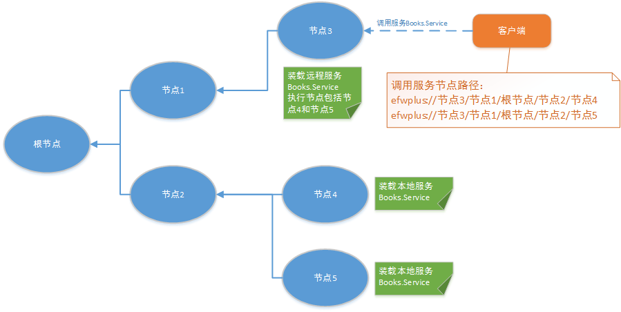
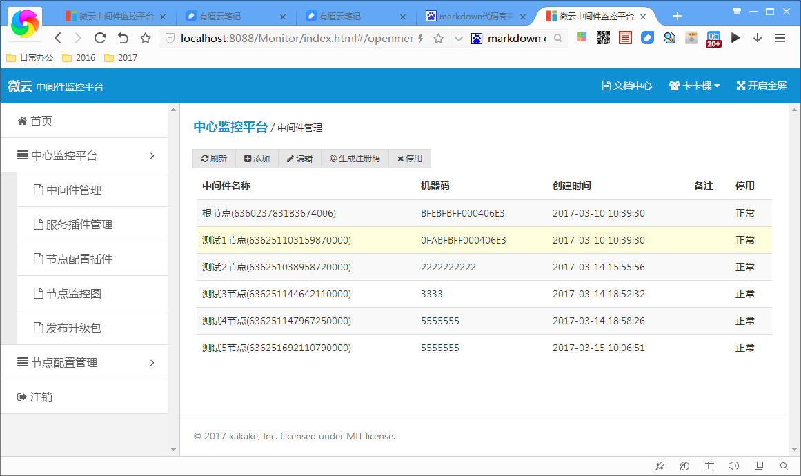
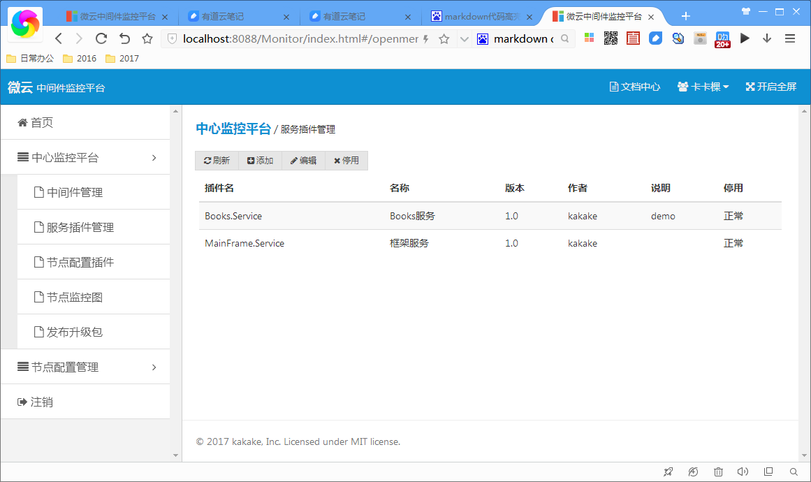
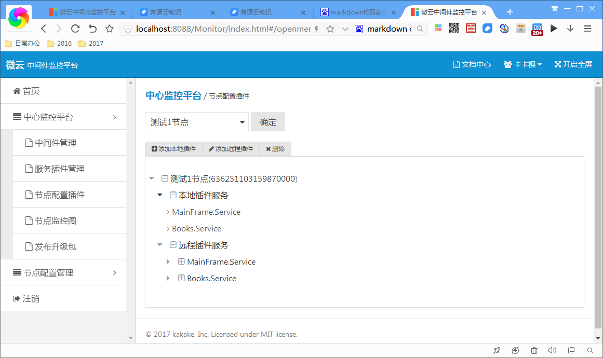
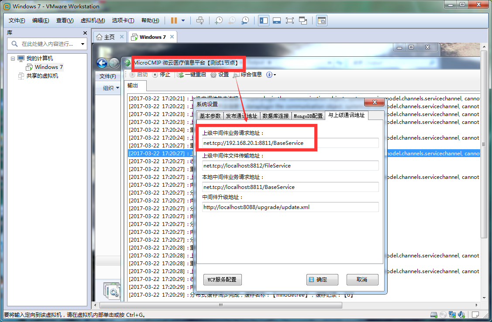
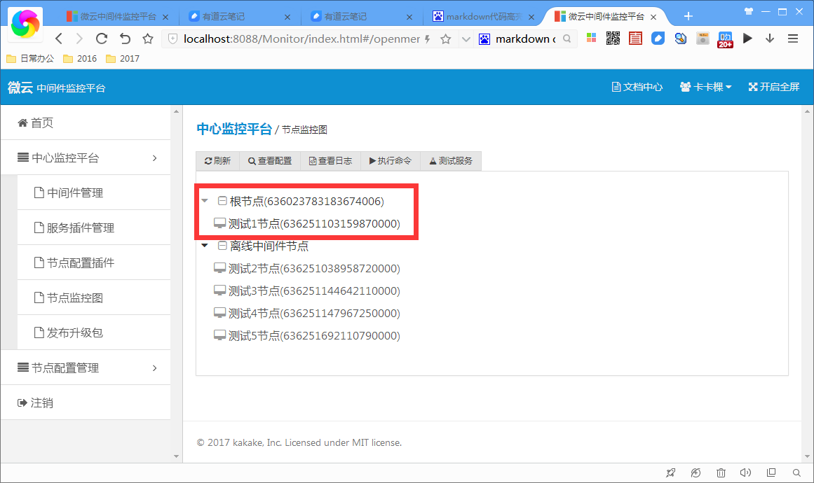
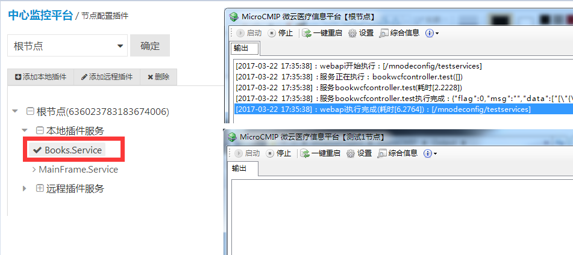
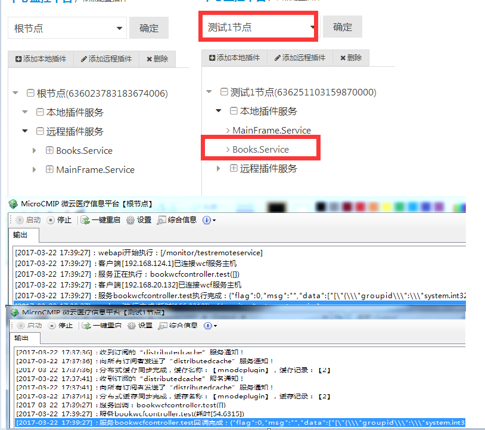

### MicroCMIP集群部署

MicroCMIP支持分布式服务，下面演示如何部署一个中间件集群。

#### 分布式中间件原理

如上图所示树形中间件集群，节点4和节点5都装载了Books.Service服务，客户端连接节点3，而节点3并没有装载本地Books.Service服务，只是配置了远程Books.Service服务并指向的执行节点包括节点4和节点5，所以客户端会远程调用节点4或节点5上的Books.Service服务，到底调用哪个节点？中间件提供负载均衡的两种算法，最短路径与随机路径，最后计算节点路径：**efwplus://节点3/节点1/根节点/节点2/节点4**，然后中间件会按照此路径进行远程调用服务。

#### 新增中间件节点

在中心平台配置的完整流程：
>1. 注册中间件节点，并获取注册码
>2. 注册插件服务
>3. 给新增的节点配置相关的本地服务和远程服务
>4. 修改中间件节点连接上级节点的通讯地址，并启动新增的中间件
>5. 在平台上可以查看节点的监控图

* 注册中间件节点

* 注册插件服务

* 配置节点服务
 

* 启动新增节点

* 节点监控图

##### 测试调用分布式服务

> 首先根节点和节点1都配置了Books.Service为本地服务，那么测试调用根节点的服务，根节点将直接返回数据，节点1不会收到请求。

> 然后根节点把Books.Service配置为远程服务,节点1配置Books.Service为本地服务，那么测试调用根节点的服务，请求会转发到节点1，返回数据回跟节点输出。

