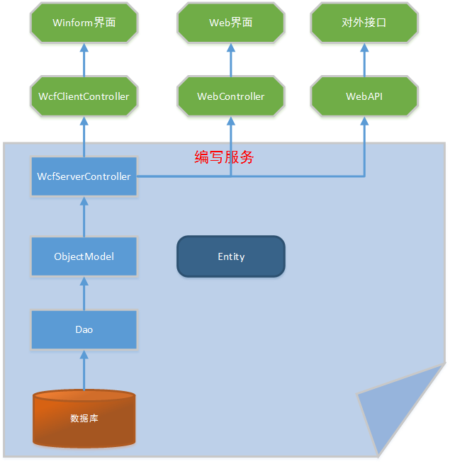
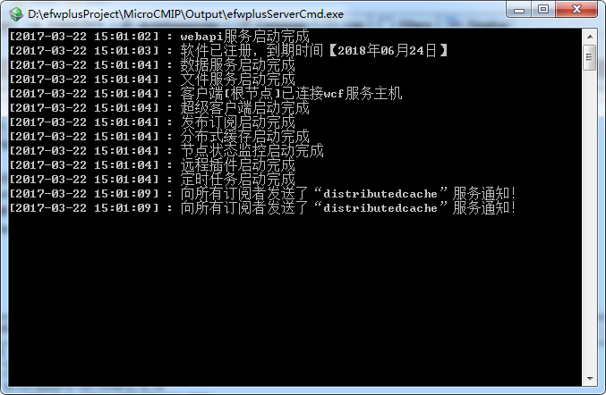
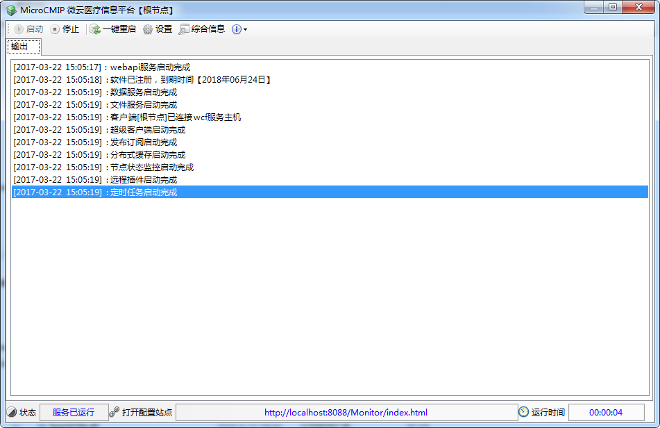
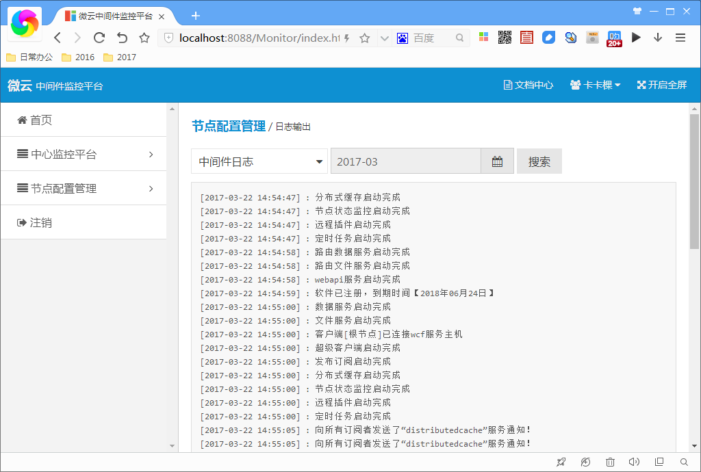
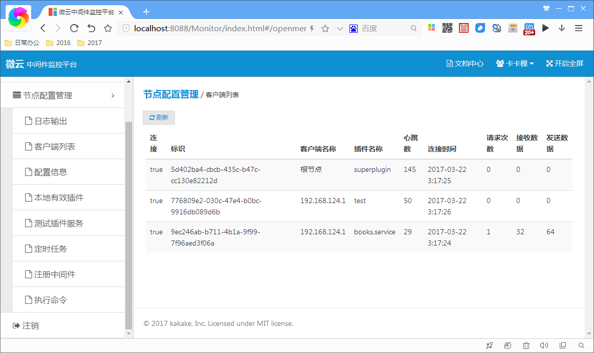
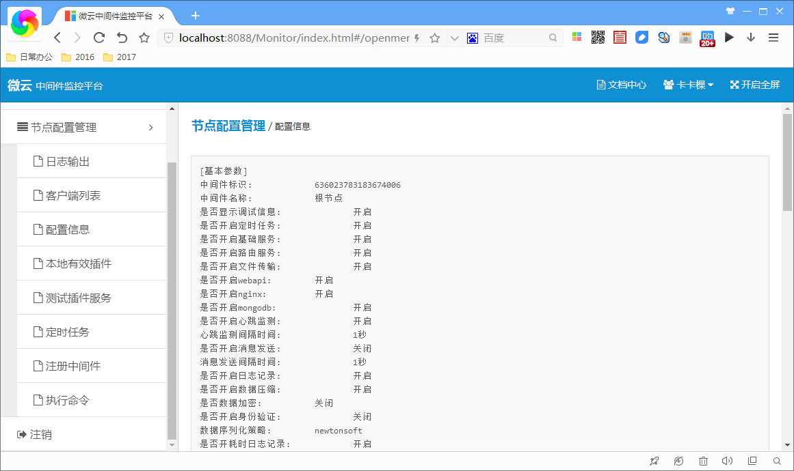
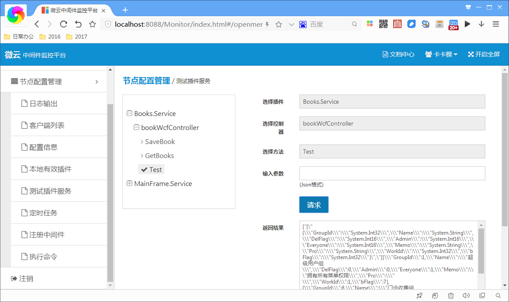

MicroCMIP
---

`MicroCMIP`是一个基于.Net的分布式服务框架，致力于为医疗信息化系统的互联互通提供统一的信息交互平台，核心功能包括`微服务开发框架`、`分布式中间件`、`通用权限管理`，`MicroCMIP`还有点类`ESB`架构，拥有`服务注册与发现`、`协议转换`、`数据适配器`、`SOA服务治理`、`服务动态路由`、`管控平台`等功能。

### 背景

随着国内医院信息化的发展，信息系统的规模不断扩大，特别是随着医疗大数据平台的建设，传统的垂直应用架构已经无法应对，分布式服务架构已经势在必行。

医院信息系统发展经过以下几个过程：

* 医院单机版的收费系统，还不具备数据互联互通的能力。
* 医院信息系统`HIS`，基本实现院内各个科室之间的数据互通，同时除了HIS陆续出现多个其他医疗业务的系统如`LIS`、`PACS`、`EMR`等。
* 目前院内信息平台与区域信息平台等，除了打通院内各个子系统之间的数据还需要打通各个医院之间的数据。

`MicroCMIP`就是为了解决建设院内与区域信息平台，实现数据服务的互联互通而生的，比如区域平台的数据量与业务量对比之前都是数量级的增加，单一应用和垂直应用架构很难应对此种规模，必须使用分布式服务架构。还有就是区域医疗机构内部的网络环境异常复杂，由多个复杂的网络环境组成，所以一般的分布式架构都适用不了，但是`MicroCMIP`能够完美支持，不管多复杂的网络环境都能适用。

#### 那么，`MicroCMIP`是什么？

`MicroCMIP` 是一个基于.Net的分布式服务框架，致力于提供高性能和透明化的`RPC`远程服务调用方案，以及`SOA`服务治理方案。

其核心部分包含:

* 微服务开发框架: 提供一整套代码分层架构，包括View、ClientController、ServerController、ObjectModel、Dao、Entity，规范了服务开发，降低层与层之间的依赖。
* 分布式中间件: 提供中间件程序，服务都部署在上面，还可以运行多个中间件节点，以树形结构搭建成中间件集群，服务以分布式方式运行在其中。
* 通用权限管理: 由于框架专注业务系统的开发，提供了一套完善的权限管理模块，包括用户管理、角色管理、菜单管理、权限分配等。

> 代码分层架构原理图



#### `MicroCMIP`能做什么？

* SOA服务治理，可以在中间件上动态装配卸载服务，以及配置服务负载均衡策略。
* 协议转换与数据适配器，别的系统提供的服务接口，比如是webservcies，框架可以通过配置直接接入中间件转化为中间件服务，同时数据格式也可以适配成框架的数据传输格式。
* 服务自动注册与发现，不再需要写死服务提供方地址，注册中心基于服务名查询服务提供者的中间件节点，并且能够平滑添加或删除服务提供者。

### 开始使用

+ [下载exe安装包](http://note.youdao.com/)

+ 获取源码
    
    你可以从GitHub项目主页获取源代码
    
    [打开源代码](http://note.youdao.com/)


#### 快速启动

> 可以分别通过命令行和桌面程序两种方式启动中间件，efwplusHosting.exe和efwplusServerCmd.exe启动其中一个即可。

* 启动efwplusServerCmd.exe

    

* 启动efwplusHosting.exe
 
    

* 打开中间件监控平台
    
在浏览器中打开http://localhost:8088/Monitor/index.html，输入用户名：admin，密码：123456登录成功进入主界面

> 日志查看



> 客户端列表



> 配置信息



> 测试服务

通过这个界面可以知道本中间件节点上装载了哪几个服务，以及服务的相关信息，并且可以在线测试调用这些服务，服务返回数据会输出在界面上。




#### 创建一个服务

插件服务配置文件: (包含服务相关的配置信息)

> plugin.xml

```xml
<?xml version="1.0" encoding="utf-8"?>
<configuration>
  <configSections>
    <section name="unity" type="Microsoft.Practices.Unity.Configuration.UnityConfigurationSection, Microsoft.Practices.Unity.Configuration, Version=2.0.414.0, Culture=neutral, PublicKeyToken=31bf3856ad364e35" />
    <section name="plugin" type="EFWCoreLib.CoreFrame.Plugin.PluginSectionHandler, EFWCoreLib.CoreFrame" />
  </configSections>
  <unity>
    <assembly name="Books_Wcf"></assembly>
    <namespace name="Books_Wcf.Dao"></namespace>
    <namespace name="Books_Wcf.UnitTest.TestDao.Dao"></namespace>
    <namespace name="Books_Wcf.Entity"></namespace>
    <namespace name="Books_Wcf.UnitTest.TestEntity"></namespace>
    <container>
      <!--真实环境-->
      <register type="IBookDao" mapTo="SqlBookDao"></register>
      <!--测试环境-->
      <!--
      <register type="IBookDao" mapTo="TestBookDao"></register>
      <register type="Books" mapTo="unBooks"></register>
      -->
    </container>
  </unity>
  <plugin name="Books.Service" version="1.0" title="Books服务" author="kakake" plugintype="Wcf" defaultdbkey="SQL2005" defaultcachekey="Cache Manager" isentry="1">
    <baseinfo>
      <data key="introduction" value="为“增删改查”的book实例提供后台服务" />
      <data key="updaterecord" value="" />
      <data key="headpic" value="" />
      <data key="StartItem" value="bookwcfclientController" />
    </baseinfo>
    <businessinfo>
      <dll name="Books_Wcf.dll" version="1.0" />
    </businessinfo>
    <issue>
    </issue>
    <setup>
    </setup>
    <menus>
    </menus>
  </plugin>
</configuration>
```

服务端控制器实现：

> bookWcfController.cs

```c#
    [WCFController]
    public class bookWcfController : WcfServerController
    {
        [WCFMethod]
        public ServiceResponseData GetBooks()
        {
            DataTable dt = NewDao<IBookDao>().GetBooks("", 0);
            responseData.AddData(dt);
            return responseData;
        }
    }
```

实体实现：

> Books.cs

```C#
    [Table(TableName = "Books", EntityType = EntityType.Table, IsGB = false)]
    public class Books:AbstractEntity
    {
        private int  _id;
        /// <summary>
        /// 
        /// </summary>
        [Column(FieldName = "Id", DataKey = true, Match = "", IsInsert = false)]
        public int Id
        {
            get { return  _id; }
            set {  _id = value; }
        }

        private string  _bookname;
        /// <summary>
        /// 
        /// </summary>
        [Column(FieldName = "BookName", DataKey = false, Match = "", IsInsert = true)]
        public string BookName
        {
            get { return  _bookname; }
            set {  _bookname = value; }
        }

        private Decimal  _buyprice;
        /// <summary>
        /// 
        /// </summary>
        [Column(FieldName = "BuyPrice", DataKey = false, Match = "", IsInsert = true)]
        public Decimal BuyPrice
        {
            get { return  _buyprice; }
            set {  _buyprice = value; }
        }

        private DateTime  _buydate;
        /// <summary>
        /// 
        /// </summary>
        [Column(FieldName = "BuyDate", DataKey = false, Match = "", IsInsert = true)]
        public DateTime BuyDate
        {
            get { return  _buydate; }
            set {  _buydate = value; }
        }

        private int  _flag;
        /// <summary>
        /// 
        /// </summary>
        [Column(FieldName = "Flag", DataKey = false, Match = "", IsInsert = true)]
        public int Flag
        {
            get { return  _flag; }
            set {  _flag = value; }
        }
    }
```

Dao接口实现：

> IBookDao.cs

```c#
    public interface IBookDao
    {
        System.Data.DataTable GetBooks(string searchChar, int flag);
    }
```

Dao实现：

> SqlBookDao.cs

```c#
    public class SqlBookDao : AbstractDao, IBookDao
    {
        public DataTable GetBooks(string searchChar, int flag)
        {
            string strsql = @"SELECT * FROM Books WHERE BookName LIKE '%{0}%' AND Flag={1}";
            strsql = string.Format(strsql, searchChar, flag);
            return oleDb.GetDataTable(strsql);
        }
    }
```

客户端控制器实现：

> bookwcfclientController.cs

```c#
    public class bookwcfclientController : WcfClientController
    {
        //获取书籍目录
        [WinformMethod]
        public void GetBooks()
        {
            //通过wcf服务调用bookWcfController控制器中的GetBooks方法
            ServiceResponseData retdata = InvokeWcfService("Books.Service", "bookWcfController", "GetBooks");
            dt = retdata.GetData<DataTable>(0);
        }
    }
```
